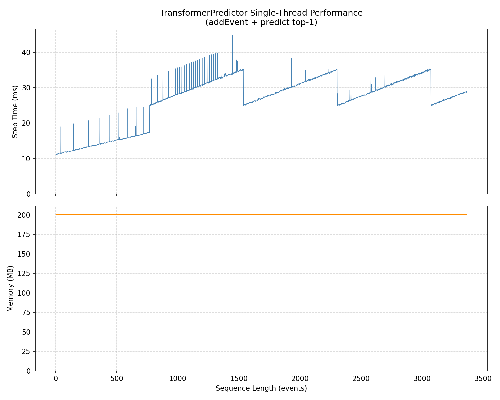

# TransformerPredictor

用于 MEMO-Appflow 的 C++ 应用预测器。封装了模型推理、事件管理与概率输出，对外仅暴露一个简单的 `TransformerPredictor` 类。

这个项目目前是 App 级别的预测，并没有深入到进程级别。

## 使用须知

- **自带缓存**：`TransformerPredictor` 内部自动管理历史事件的缓存。你只需在开始时创建一次实例，随后持续调用 `addEvent()` 和 `predict()`，**不要频繁销毁重建**。
- **关注窗口**：根据当前事件规模，内部会动态维护一个大致在 **768 ~ 1536 个 App 事件** 范围内的有效上下文窗口。这意味着当历史很长时，旧事件会被自动丢弃，而近期事件始终保留。
- **权重文件**：运行时需要 `weights.bin`（模型参数，约 22MB）和 `manifest.txt`（参数描述文件）两个文件。
- **默认单线程**：CMake 配置默认不使用多线程。如果希望开启 OpenMP 加速，请确保系统支持并在编译时检测到 OpenMP。（目前没有深度优化，开多线程加速没啥效果）

## 快速编译

在项目根目录（即 `TransformerPredictor/` 目录）执行：

```bash
mkdir build && cd build
cmake .. && make -j4
./example
```

要求：
- C++17 兼容编译器
- CMake 3.14+

## 接口说明

### 数据类型

```cpp
struct AppEvent {
    std::string appName;        // 应用包名或显示名称
    float startTimeMinutes;     // 开始时间（累积分钟，可跨天递增）
    float endTimeMinutes;       // 结束时间（累积分钟）
    float startHourOfDay;       // 开始时刻的小时 (0-24)
    float endHourOfDay;         // 结束时刻的小时 (0-24)
};

struct Prediction {
    std::string appName;        // 预测的应用名称
    float probability;          // 概率 (0-1)
};
```

### 核心类

```cpp
namespace transformer {

class TransformerPredictor {
public:
    // 构造：传入权重和清单的绝对路径
    TransformerPredictor(const std::string& weightsPath,
                         const std::string& manifestPath);

    // 添加一个事件（内部会拆分为打开+关闭两个 token）
    void addEvent(const AppEvent& event);

    // 批量添加
    void addEvents(const std::vector<AppEvent>& events);

    // 预测下一个应用，返回 topK 个结果（按概率降序）
    std::vector<Prediction> predict(int topK);

    // 清空所有状态（包括历史与缓存）
    void clear();

    // 获取当前已添加的 App 事件数
    size_t getEventCount() const;
};

}
```

## 使用示例

完整代码见同目录下的 `example.cpp`：

```cpp
#include "transformer_predictor.h"
using namespace transformer;

// 1. 初始化（应在应用启动时创建并保留）
TransformerPredictor predictor("weights/weights.bin", "weights/manifest.txt");

// 2. 持续添加历史事件
for (const auto& e : history) {
    predictor.addEvent(e);
}

// 3. 获取 Top-5 预测
auto preds = predictor.predict(5);
for (auto& p : preds) {
    std::cout << p.appName << ": " << p.probability << std::endl;
}
```

## 运行效果

使用仓库自带的 `example.json`（取自 **lsapp 数据集**）运行 `example` 程序的输出如下：

```
Loaded 3368 events

Warmup with 100 events...
Done. Event count: 100

==================================================
演示 5 次 AddEvent + Predict
==================================================

--- Round 1 ---
Input (AppEvent):
  appName:          "Samsung Internet Browser"
  startTimeMinutes: 443751
  endTimeMinutes:   443753
  startHourOfDay:   3.84778
  endHourOfDay:     3.88722

Output (Top-5 Prediction):
  [0] appName: "Samsung Email", probability: 0.6434
  [1] appName: "Messages", probability: 0.1552
  [2] appName: "Contacts", probability: 0.0812
  [3] appName: "Maps", probability: 0.0648
  [4] appName: "Calculator", probability: 0.0050

Next ground truth: "Samsung Email"

--- Round 2 ---
Input (AppEvent):
  appName:          "Samsung Email"
  startTimeMinutes: 443783.2812
  endTimeMinutes:   443783.2812
  startHourOfDay:   4.3881
  endHourOfDay:     4.3881

Output (Top-5 Prediction):
  [0] appName: "Samsung Internet Browser", probability: 0.6917
  [1] appName: "Maps", probability: 0.1418
  [2] appName: "Contacts", probability: 0.0693
  [3] appName: "Messages", probability: 0.0369
  [4] appName: "Camera", probability: 0.0104

Next ground truth: "Samsung Internet Browser"

--- Round 3 ---
Input (AppEvent):
  appName:          "Samsung Internet Browser"
  startTimeMinutes: 443783.4062
  endTimeMinutes:   444330.2188
  startHourOfDay:   4.3900
  endHourOfDay:     13.5036

Output (Top-5 Prediction):
  [0] appName: "Samsung Email", probability: 0.4733
  [1] appName: "Messages", probability: 0.1804
  [2] appName: "Maps", probability: 0.1321
  [3] appName: "Contacts", probability: 0.1114
  [4] appName: "Settings", probability: 0.0104

Next ground truth: "Calculator"

--- Round 4 ---
Input (AppEvent):
  appName:          "Calculator"
  startTimeMinutes: 444330.3125
  endTimeMinutes:   444330.6875
  startHourOfDay:   13.5050
  endHourOfDay:     13.5114

Output (Top-5 Prediction):
  [0] appName: "Samsung Internet Browser", probability: 0.5479
  [1] appName: "Messages", probability: 0.1291
  [2] appName: "Maps", probability: 0.0834
  [3] appName: "Samsung Email", probability: 0.0717
  [4] appName: "Contacts", probability: 0.0456

Next ground truth: "Samsung Internet Browser"

--- Round 5 ---
Input (AppEvent):
  appName:          "Samsung Internet Browser"
  startTimeMinutes: 444330.7188
  endTimeMinutes:   444332.1875
  startHourOfDay:   13.5119
  endHourOfDay:     13.5367

Output (Top-5 Prediction):
  [0] appName: "Samsung Email", probability: 0.3858
  [1] appName: "Messages", probability: 0.2019
  [2] appName: "Maps", probability: 0.1109
  [3] appName: "Calculator", probability: 0.0962
  [4] appName: "Contacts", probability: 0.0741

Next ground truth: "Google Play Store"
```

## 性能基准

以下数据来自在整个 **lsapp 数据集** 上的全量模拟测试，使用 `example.json`（共 3368 条记录）。

**测试条件**：
- **单线程**（`OMP_NUM_THREADS=1`）
- 每步操作：`addEvent` + `predict(top-1)`
- 过滤掉单步耗时 **> 50 ms** 的波动点（共 3 个点被过滤）

**结果**：

| 指标 | 数值 |
|------|------|
| 总事件数 | 3368 |
| 单步时间范围 | **11.1 ms ~ 44.8 ms** |
| 初始化后常驻内存 | **≈ 200 MB** |

**说明**：
- 内存主要由两部分构成：模型参数（双实例，约 44 MB）和 KV Cache 预分配（双实例 × 8 层 × 4096 max_len，约 128 MB），其余为运行时开销。
- 时间曲线呈典型的锯齿状：随着序列增长逐步上升至窗口边界（约 35~45 ms），窗口滑动重置后陡降至约 25 ms，再重新爬升。这反映了内部的自动缓存管理机制。



## 准确率结果

在整个 **lsapp 数据集** 上评估 `TransformerPredictor` 的预测准确率如下：

| Predictor | Hit@1 | Hit@3 | Hit@5 |
|-----------|:-----:|:-----:|:-----:|
| **TransformerPredictor** | **66.92 %** | **84.56 %** | **90.83 %** |

## 集成到主项目

本目录位于 `app/src/main/cpp/TransformerPredictor/`，已被主项目的 `CMakeLists.txt` 引用。JNI 胶水层开发者只需关注 `transformer_predictor.h` 中的 `TransformerPredictor` 类即可。
